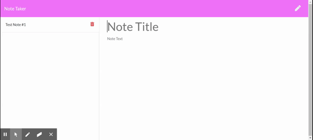

<h1 align="center">Note Taker</h1>

  [](https://opensource.org/licenses/MIT)


## Table of Contents

  - [Description](#description)
  - [Demo](#demo)
  - [Installation](#installation)
  - [Usage](#usage)
  - [Contributors](#contributors)
  - [Tests](#tests)
  - [License](#license)
  - [Technologies](#technologies)
  - [Questions](#questions)

  
  ## Description
  For this assignment, we had to modify starter code to create an application called Note Taker that can be used to write and save notes. This application will use an Express.js back end and will save and retrieve note data from a JSON file.

  ## Demo

  

  To view the full demo, please direct yourself to ```assests``` folder.
  

  ## Installation
 In the command-line, type 'node i' for the following npm packages:
 ``` 
 express
  ```
 ``` 
 fs 
 ```
 ``` 
 path
  ```

  Once all third-party packages have been successfully installed, the application is ready to use. For more details, reference the application's ```package.json``` file.

  ## Usage
  To launch the application, please visit this link to Heroku - https://fast-reef-84596.herokuapp.com/
  
  When the user opens the note taker, they are prompted with a landing page with a link to the notes page. When you click into the notes page, you are presented with existing notes in the left-hand column and empty fields to input new notes in the right-hand column. When you enter a note title and note text, a save button will appear allowing the user to save that note with the other existing notes on the left. The user is able to view these notes after they have been created by clicking on them in the left-hand column. The user can delete notes from the existing list if they'd like.

  ## Contributors
  Emily B. Todt

  ## Tests
  
  No tests were included.

  ## License
  
        Copyright (c) 2021 Emily B. Todt 
        Licensed under the [MIT license](https://opensource.org/licenses/MIT).
      

  ## Technologies
  JavaScript, Node.js, HTML, CSS

  ## Questions
  Reach me on [GitHub](https://www.github.com/todtsies)  
  Reach me via email at <emilybtodt@gmail.com>

